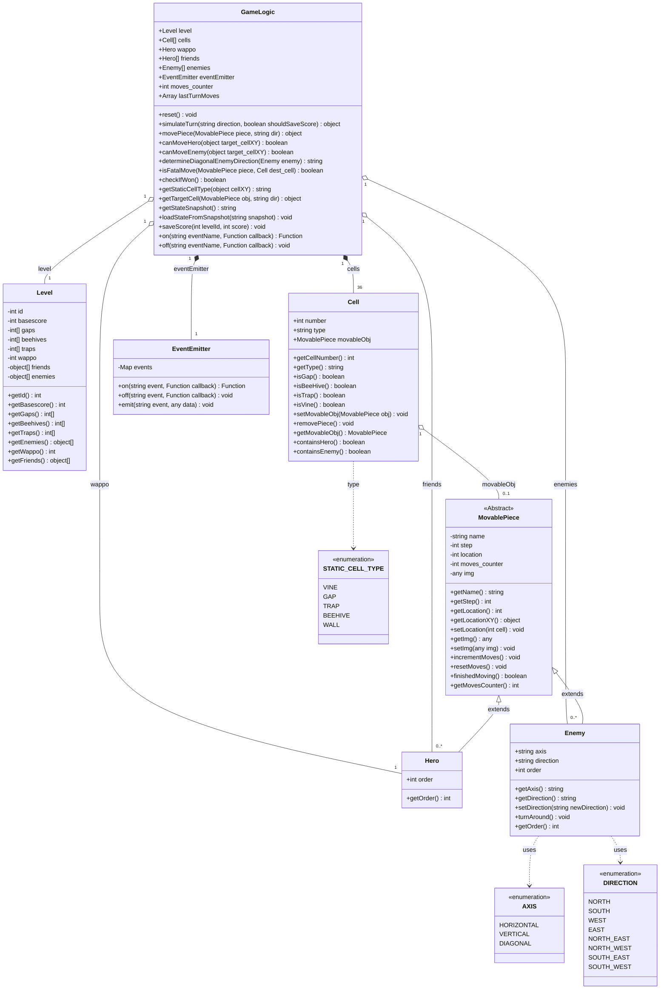

```mermaid
classDiagram
    class GameLogic {
        +Level level
        +Cell[] cells
        +Hero wappo
        +Hero[] friends
        +Enemy[] enemies
        +EventEmitter eventEmitter
        +int moves_counter
        +Array lastTurnMoves
        +reset() void
        +simulateTurn(string direction, boolean shouldSaveScore) object
        +movePiece(MovablePiece piece, string dir) object
        +canMoveHero(object target_cellXY) boolean
        +canMoveEnemy(object target_cellXY) boolean
        +determineDiagonalEnemyDirection(Enemy enemy) string
        +isFatalMove(MovablePiece piece, Cell dest_cell) boolean
        +checkIfWon() boolean
        +getStaticCellType(object cellXY) string
        +getTargetCell(MovablePiece obj, string dir) object
        +getStateSnapshot() string
        +loadStateFromSnapshot(string snapshot) void
        +saveScore(int levelId, int score) void
        +on(string eventName, Function callback) Function
        +off(string eventName, Function callback) void
    }

    class Level {
        -int id
        -int basescore
        -int[] gaps
        -int[] beehives
        -int[] traps
        -int wappo
        -object[] friends
        -object[] enemies
        +getId() int
        +getBasescore() int
        +getGaps() int[]
        +getBeehives() int[]
        +getTraps() int[]
        +getEnemies() object[]
        +getWappo() int
        +getFriends() object[]
    }

    class Cell {
        +int number
        +string type
        +MovablePiece movableObj
        +getCellNumber() int
        +getType() string
        +isGap() boolean
        +isBeeHive() boolean
        +isTrap() boolean
        +isVine() boolean
        +setMovableObj(MovablePiece obj) void
        +removePiece() void
        +getMovableObj() MovablePiece
        +containsHero() boolean
        +containsEnemy() boolean
    }

    class MovablePiece {
        <<Abstract>>
        -string name
        -int step
        -int location
        -int moves_counter
        -any img
        +getName() string
        +getStep() int
        +getLocation() int
        +getLocationXY() object
        +setLocation(int cell) void
        +getImg() any
        +setImg(any img) void
        +incrementMoves() void
        +resetMoves() void
        +finishedMoving() boolean
        +getMovesCounter() int
    }

    class Hero {
        +int order
        +getOrder() int
    }

    class Enemy {
        +string axis
        +string direction
        +int order
        +getAxis() string
        +getDirection() string
        +setDirection(string newDirection) void
        +turnAround() void
        +getOrder() int
    }

    class EventEmitter {
        -Map events
        +on(string event, Function callback) Function
        +off(string event, Function callback) void
        +emit(string event, any data) void
    }

    class STATIC_CELL_TYPE {
        <<enumeration>>
        VINE
        GAP
        TRAP
        BEEHIVE
        WALL
    }

    class AXIS {
        <<enumeration>>
        HORIZONTAL
        VERTICAL
        DIAGONAL
    }

    class DIRECTION {
        <<enumeration>>
        NORTH
        SOUTH
        WEST
        EAST
        NORTH_EAST
        NORTH_WEST
        SOUTH_EAST
        SOUTH_WEST
    }

    GameLogic "1" o-- "1" Level : level
    GameLogic "1" *-- "36" Cell : cells
    GameLogic "1" o-- "1" Hero : wappo
    GameLogic "1" o-- "0..*" Hero : friends
    GameLogic "1" o-- "0..*" Enemy : enemies
    GameLogic "1" *-- "1" EventEmitter : eventEmitter

    Cell "1" o-- "0..1" MovablePiece : movableObj
    Cell ..> STATIC_CELL_TYPE : type

    MovablePiece <|-- Hero : extends
    MovablePiece <|-- Enemy : extends

    Enemy ..> AXIS : uses
    Enemy ..> DIRECTION : uses
```
