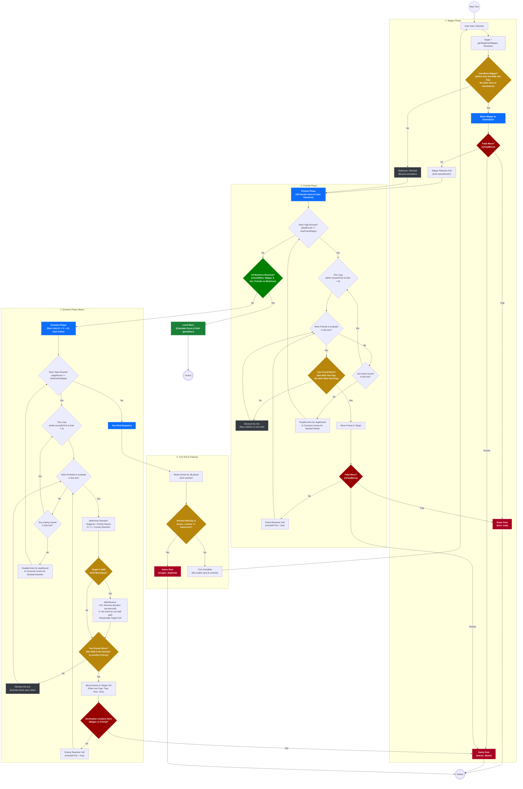

```mermaid
flowchart TD
    classDef blueBox fill:#0d6efd,stroke:#fff,color:#fff,font-weight:bold;
    classDef redDiamond fill:#990000,stroke:#fff,color:#fff,font-weight:bold;
    classDef greenDiamond fill:#008000,stroke:#fff,color:#fff,font-weight:bold;
    classDef yellowDiamond fill:#b8860b,stroke:#fff,color:#fff,font-weight:bold;
    classDef redBox fill:#aa0022,stroke:#fff,color:#fff,font-weight:bold;
    classDef greenBox fill:#1a8038,stroke:#fff,color:#fff,font-weight:bold;
    classDef grayBox fill:#343a40,stroke:#fff,color:#fff;

    Start((Start Turn)) --> UserInput["User Input: Direction"]

    subgraph PHASE_1["1. Wappo Phase"]
        UserInput --> CalcWappo["Target = getTargetCell(Wappo, Direction)"]
        CalcWappo --> CanWappo{"Can Move Wappo?<br/>(Within 6x6, Not Wall, Not Gap,<br/>No other Hero at destination)"}
        
        CanWappo -- No --> StatWappo["Stationary / Blocked<br/>(Bounce animation)"]
        CanWappo -- Yes --> MoveWappo["Move Wappo to Destination"]
        
        MoveWappo --> WappoFatal{"Fatal Move?<br/>(isFatalMove)"}
        WappoFatal -- "Trap" --> GameOverTrap["Game Over<br/>(hero_trap)"]
        WappoFatal -- "Enemy" --> GameOverEnemy["Game Over<br/>(enemy_attack)"]
        WappoFatal -- "No" --> WappoSuccess["Wappo Reaches Cell<br/>(Emit 'pieceMoved')"]
    end

    WappoSuccess --> Phase2_Start
    StatWappo --> Phase2_Start

    subgraph PHASE_2["2. Friends Phase"]
        Phase2_Start["Friends Phase<br/>(All friends move in User Direction)"] --> FriendRound{"More Step Rounds?<br/>(stepRound <= maxFriendSteps)"}
        
        FriendRound -- Yes --> FriendTickLoop{"Tick Loop<br/>(while movedInTick & ticks < 6)"}
        FriendTickLoop --> MoreFriendsInTick{"More Friends to evaluate<br/>in this tick?"}
        
        MoreFriendsInTick -- Yes --> CanFriend{"Can Friend Move?<br/>(Not Wall, Not Gap,<br/>No other Bear blocking)"}
        CanFriend -- No --> FriendBlocked["Blocked this tick<br/>(May unblock on next tick)"] --> MoreFriendsInTick
        
        CanFriend -- Yes --> MoveFriend["Move Friend to Target"]
        MoveFriend --> FriendFatal{"Fatal Move?<br/>(isFatalMove)"}
        FriendFatal -- "Trap" --> GameOverTrap
        FriendFatal -- "Enemy" --> GameOverEnemy
        FriendFatal -- "No" --> FriendMoved["Friend Reaches Cell<br/>(movedInTick = true)"] --> MoreFriendsInTick
        
        MoreFriendsInTick -- No --> CheckTickMoved{"Any friend moved<br/>in this tick?"}
        CheckTickMoved -- Yes --> FriendTickLoop
        CheckTickMoved -- No --> EndStepRoundFriends["Parallel Anim for stepRound<br/>& Consume moves for blocked friends"] --> FriendRound
        
        FriendRound -- No --> WinCheck{"All Beehives Reached?<br/>(checkIfWon: Wappo & ALL Friends on Beehives)"}
    end

    WinCheck -- Yes --> LevelWon["Level Won!<br/>(Calculate Score & Emit 'gameWon')"]
    LevelWon --> EndWin(((Victory)))
    WinCheck -- No --> Phase3_Start

    subgraph PHASE_3["3. Enemies Phase (Bees)"]
        Phase3_Start["Enemies Phase<br/>(Sort: Axis H -> V -> D, then Order)"] --> EnemyRound{"More Step Rounds?<br/>(stepRound <= maxEnemySteps)"}
        
        EnemyRound -- Yes --> EnemyTickLoop{"Tick Loop<br/>(while movedInTick & ticks < 6)"}
        EnemyTickLoop --> MoreEnemiesInTick{"More Enemies to evaluate<br/>in this tick?"}
        
        MoreEnemiesInTick -- Yes --> DetermineDir["Determine Direction:<br/>Diagonal = Priority Search<br/>H / V = Current Direction"]
        DetermineDir --> WallCheck{"Target is Wall<br/>(Grid Boundary)?"}
        
        WallCheck -- Yes --> BounceWall["Wall Bounce:<br/>H/V: Reverse direction (turnAround)<br/>D: Re-orient to non-wall path<br/>Recalculate Target Cell"] --> CanEnemy
        WallCheck -- No --> CanEnemy{"Can Enemy Move?<br/>(Not Wall & Not blocked by another Enemy)"}
        
        CanEnemy -- No --> EnemyBlocked["Blocked this tick<br/>(Enemies block each other)"] --> MoreEnemiesInTick
        CanEnemy -- Yes --> MoveEnemy["Move Enemy to Target Cell<br/>(Flies over Gap, Trap, Hive, Vine)"]
        
        MoveEnemy --> EnemyHeroCollision{"Destination contains Hero<br/>(Wappo or Friend)?"}
        EnemyHeroCollision -- Yes --> GameOverEnemy
        EnemyHeroCollision -- No --> EnemyMoved["Enemy Reaches Cell<br/>(movedInTick = true)"] --> MoreEnemiesInTick
        
        MoreEnemiesInTick -- No --> CheckEnemyTickMoved{"Any enemy moved<br/>in this tick?"}
        CheckEnemyTickMoved -- Yes --> EnemyTickLoop
        CheckEnemyTickMoved -- No --> EndStepRoundEnemies["Parallel Anim for stepRound<br/>& Consume moves for blocked enemies"] --> EnemyRound
        
        EnemyRound -- No --> Phase4_Start
    end

    subgraph PHASE_4["4. Turn End & Cleanup"]
        Phase4_Start["Turn End Sequence"] --> ResetMoves["Reset moves for all pieces<br/>Emit 'turnEnd'"]
        ResetMoves --> OxygenCheck{"Normal Difficulty &<br/>moves_counter >= basescore?"}
        
        OxygenCheck -- Yes --> GameOverOxygen["Game Over<br/>(oxygen_depleted)"]
        OxygenCheck -- No --> TurnComplete["Turn Complete<br/>(Re-enable input & controls)"]
        TurnComplete --> UserInput
    end

    GameOverTrap --> EndFail(((Defeat)))
    GameOverEnemy --> EndFail
    GameOverOxygen --> EndFail

    class MoveWappo,Phase2_Start,Phase3_Start,Phase4_Start blueBox;
    class WappoFatal,FriendFatal,EnemyHeroCollision redDiamond;
    class CanWappo,CanFriend,CanEnemy,WallCheck,OxygenCheck yellowDiamond;
    class WinCheck greenDiamond;
    class GameOverTrap,GameOverEnemy,GameOverOxygen redBox;
    class LevelWon greenBox;
    class StatWappo,FriendBlocked,EnemyBlocked grayBox;
```