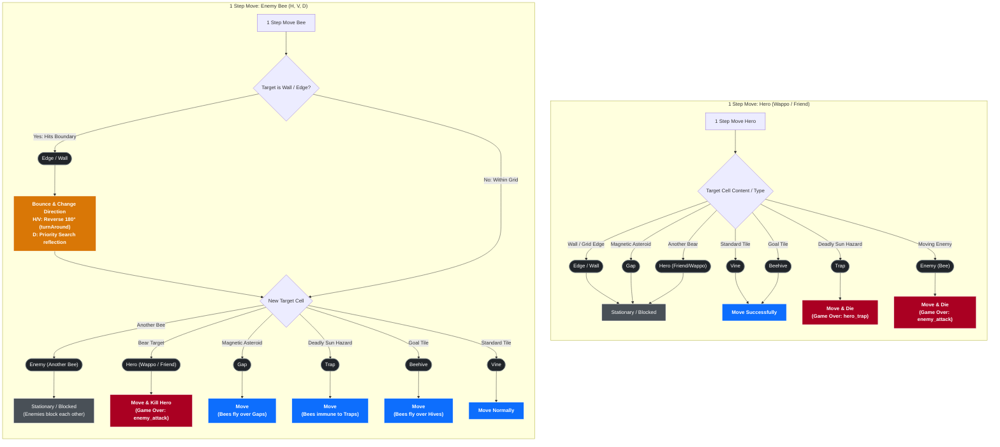

```mermaid
flowchart TD
    classDef moveBox fill:#0d6efd,stroke:#fff,color:#fff,font-weight:bold;
    classDef statBox fill:#495057,stroke:#fff,color:#fff;
    classDef dieBox fill:#aa0022,stroke:#fff,color:#fff,font-weight:bold;
    classDef bounceBox fill:#d97706,stroke:#fff,color:#fff,font-weight:bold;
    classDef cellNode fill:#212529,stroke:#6c757d,color:#fff;

    subgraph Hero["1 Step Move: Hero (Wappo / Friend)"]
        direction TD
        H1["1 Step Move Hero"] --> H_DC{"Target Cell Content / Type"}
        
        H_DC -->|Wall / Grid Edge| H_Edge(["Edge / Wall"])
        H_DC -->|Magnetic Asteroid| H_Gap(["Gap"])
        H_DC -->|Another Bear| H_Hero(["Hero (Friend/Wappo)"])
        H_DC -->|Standard Tile| H_Vine(["Vine"])
        H_DC -->|Goal Tile| H_Hive(["Beehive"])
        H_DC -->|Deadly Sun Hazard| H_Trap(["Trap"])
        H_DC -->|Moving Enemy| H_Enemy(["Enemy (Bee)"])
        
        H_Edge --> H_Stat["Stationary / Blocked"]
        H_Gap --> H_Stat
        H_Hero --> H_Stat
        
        H_Vine --> H_Move["Move Successfully"]
        H_Hive --> H_Move
        
        H_Trap --> H_DieTrap["Move & Die<br/>(Game Over: hero_trap)"]
        H_Enemy --> H_DieEnemy["Move & Die<br/>(Game Over: enemy_attack)"]
    end

    subgraph Bee["1 Step Move: Enemy Bee (H, V, D)"]
        direction TD
        B1["1 Step Move Bee"] --> B_WallCheck{"Target is Wall / Edge?"}
        
        B_WallCheck -->|Yes: Hits Boundary| B_Edge(["Edge / Wall"])
        B_Edge --> B_Bounce["Bounce & Change Direction<br/>H/V: Reverse 180° (turnAround)<br/>D: Priority Search reflection"]
        B_Bounce --> B_DC{"New Target Cell"}
        
        B_WallCheck -->|No: Within Grid| B_DC
        
        B_DC -->|Another Bee| B_Bee(["Enemy (Another Bee)"])
        B_DC -->|Bear Target| B_Hero(["Hero (Wappo / Friend)"])
        B_DC -->|Magnetic Asteroid| B_Gap(["Gap"])
        B_DC -->|Deadly Sun Hazard| B_Trap(["Trap"])
        B_DC -->|Goal Tile| B_Hive(["Beehive"])
        B_DC -->|Standard Tile| B_Vine(["Vine"])
        
        B_Bee --> B_Stat["Stationary / Blocked<br/>(Enemies block each other)"]
        B_Hero --> B_Kill["Move & Kill Hero<br/>(Game Over: enemy_attack)"]
        
        B_Gap --> B_Fly["Move<br/>(Bees fly over Gaps)"]
        B_Trap --> B_FlyTrap["Move<br/>(Bees immune to Traps)"]
        B_Hive --> B_FlyHive["Move<br/>(Bees fly over Hives)"]
        B_Vine --> B_Move["Move Normally"]
    end

    class H_Move,B_Fly,B_FlyTrap,B_FlyHive,B_Move moveBox;
    class H_Stat,B_Stat statBox;
    class H_DieTrap,H_DieEnemy,B_Kill dieBox;
    class B_Bounce bounceBox;
    class H_Edge,H_Gap,H_Hero,H_Vine,H_Hive,H_Trap,H_Enemy,B_Edge,B_Bee,B_Hero,B_Gap,B_Trap,B_Hive,B_Vine cellNode;
```